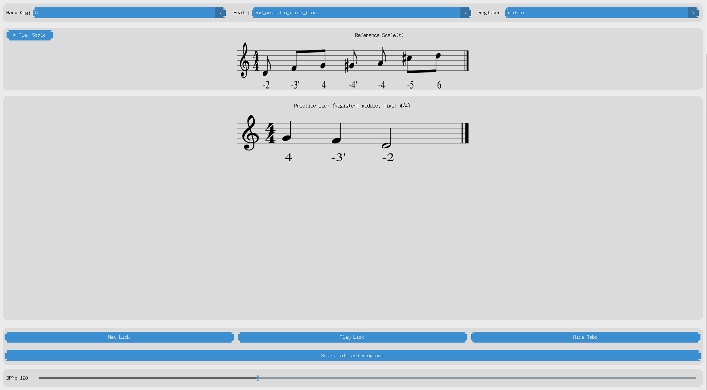

 Harmonica Ear Trainer

This application is a tool designed for diatonic harmonica players to improve their ear training. It helps you learn to recognize licks and scales by ear, providing a "call and response" style of practice.



## Features

- **Lick Training**: The app plays a random lick, which you then try to replicate on your own instrument.
- **Visual Feedback**: After listening, you can reveal the harmonica tabs to check your accuracy.
- **Call and Response Mode**: A dedicated mode plays the lick, then provides a metronome beat for you to play along, creating a realistic practice loop.
- **Customizable Practice**:
    - **Key Selection**: Choose from various harmonica keys (G, A, C, D).
    - **Scale Selection**: Focus your practice on specific scales and positions.
    - **Register Control**: Isolate low, middle, high, or mixed registers of the harmonica.
    - **Adjustable BPM**: Control the playback speed to match your skill level.
- **Reference Scales**: Listen to and view the tabs for the complete scale to familiarize yourself with the sound and tab layout.

## How It Works

The application uses a library of pre-recorded harmonica samples and musical licks stored in JSON files. When you select a key, scale, and register, the app randomly selects a lick from that category to play for you. The core functionality is built with Python using the `customtkinter` library for the user interface and `pydub` for audio playback.

## Getting Started

### Prerequisites

- Python 3.x
- `pip` (Python package installer)

### Installation

1.  **Clone the repository:**
    ```bash
    git clone [https://github.com/davknei/eartraining_trainer.git](https://github.com/davknei/eartraining_trainer.git)
    cd eartraining_trainer/code
    ```

2.  **Install the required Python libraries:**
    ```bash
    pip install -r requirements.txt
    ```

3.  **Run the application:**
    ```bash
    python app.py
    ```

## Project Structure

-   `app.py`: The main application file that runs the GUI and handles user interactions.
-   `audio_player.py`: Manages loading and playing all audio samples, including licks and metronome sounds.
-   `lick_manager.py`: Handles loading and selecting licks from the JSON files based on user-selected criteria.
-   `helper_func_app.py`: Contains helper functions used by the main application.
-   `generate_score_images.py`: A utility script for pre-rendering the musical notation of licks into images for faster display.
-   `/audio_samples`: Contains the `.wav` files for each note on the harmonica, organized by key.
-   `/licks`: Contains the JSON files that define the musical licks and scales.
-   `/images`: Stores the pre-rendered images of the musical scores.

## Contributing

Contributions are welcome! If you have ideas for new features, bug fixes, or improvements, feel free to open an issue or submit a pull request.